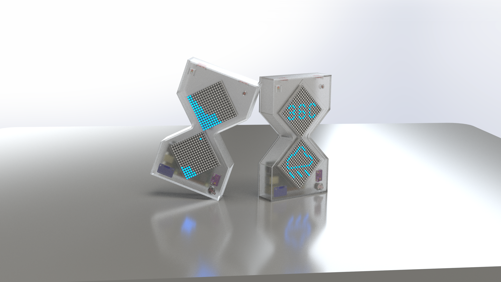

# **FluxSand - Interactive Digital Hourglass**

🚀 **FluxSand** is an **interactive digital hourglass** designed using **real-time embedded systems**. It combines **gyroscope sensing, LED matrix display, and touch interaction** to create a dynamic and visually engaging timekeeping experience. By leveraging advanced sensor fusion and real-time processing, this system responds seamlessly to user actions, providing an immersive interaction.

---

## **📌 Project Overview**

**FluxSand** utilizes **sensor fusion technology** and **real-time processing** to simulate a physical hourglass in a unique way:

- **Smart Flow Effect**: The LED matrix dynamically displays the movement of sand grains, adapting to device orientation.
- **Multiple Modes**:
  * **Pomodoro Timer Mode**
  * **Weather Clock Mode**
  * **Timing/Countdown Mode**
- **Enhanced Physical Interaction**: Users can flip the device or use touch buttons to control functions like pause, speed adjustment, or reset.
- **Adaptive Brightness**: A light sensor detects ambient light levels and automatically adjusts LED brightness for optimal visibility.
- **Audio Feedback**: The buzzer provides audio cues when the countdown finishes or when switching modes, enhancing user experience.

---

## **🎯 Key Features**

✅ **Real-time sensor data acquisition**: The MPU9250 gyroscope & accelerometer detect device orientation to control sand flow direction and speed.  
✅ **High-efficiency LED visual display**: MAX7219 LED matrix presents fluid hourglass effects and weather information.  
✅ **Touch button interaction**: Users can switch between different modes, such as a countdown timer or a weather clock.  
✅ **Smart brightness adjustment**: The light sensor automatically modifies LED brightness based on ambient conditions.  
✅ **Audio feedback**: The buzzer signals key events, such as countdown completion or mode changes.  
✅ **Temperature & air pressure detection**: A thermistor measures the ambient temperature, while the BMP280 sensor provides air pressure readings for the weather clock mode.  

---

## **🔧 Hardware Components**

| Component | Specification | Quantity | Purpose |
|-----------|--------------|----------|---------|
| **MAX7219 LED Matrix** | 8x8 units | 8 | Hourglass visualization & weather clock display |
| **GY-91 MPU9250 + BMP280** | 9-axis gyroscope & pressure sensor | 1 | Orientation detection & sand flow control & air pressure measurement |
| **TTP223 Touch Button** | Capacitive | 2 | Interaction control (mode switching) |
| **Buzzer** | 5V active | 1 | Audio alerts |
| **Light Sensor** | 5506 | 1 | Light detection for automatic brightness adjustment |
| **Thermistor** | NTC 10kΩ | 1 | Temperature measurement |
| **Raspberry Pi** | Main controller | 1 | Data processing & computation |

---

## **💻 Software Architecture**

This project is developed primarily in **C++**, running on a **Linux + Raspberry Pi** platform, utilizing an **event-driven real-time architecture** to ensure seamless interactions.

**📌 Code Structure**
TODO:

**📌 Key Technologies**

- **Event-driven programming**: Uses **callbacks** to process sensor inputs & LED refresh, avoiding blocking operations and ensuring responsiveness.
- **Multithreading control**: Separates data acquisition & display updates for real-time performance.
- **GitHub version control**: Implements **Git for version tracking**, including commit history, issue tracking, and pull requests for structured development.

---

## **🚀 Development Progress**

🔄 **Hardware selection & procurement**  
🔄 **Initial code framework setup (C++ & sensor drivers)**  
🔄 **Optimization of real-time data processing**  
🔄 **Enhancing user interaction (touch buttons & LED animation)**  
🔄 **Software testing & debugging**  
📢 **Project promotion (social media & Hackaday)**  

---

## **📢 Future Improvements**

🔹 **Additional visual display modes**, such as different sand animations or symbol-based representations.  
🔹 **Wireless remote control**, allowing users to configure settings via WiFi/Bluetooth.  
🔹 **Data storage & visualization**, enabling users to track historical temperature & air pressure readings via a web interface.  

---

## **🔗 Relevant Links**

📌 **GitHub Repository**: *Coming soon 🚀*  
📌 **Demo Video**: *Uploading soon 🎥*  
📌 **Social Media Promotion**: *Planned for Hackaday /Twitter 📢*  
